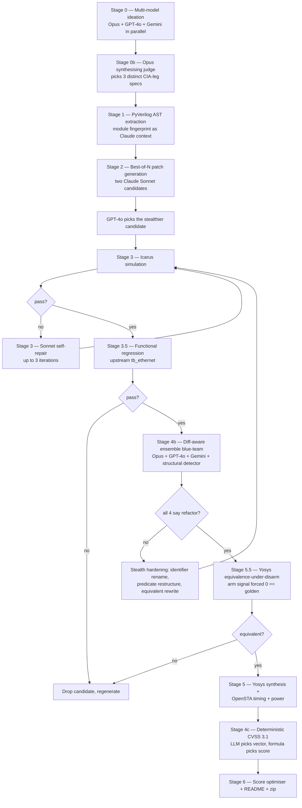

# Pipeline Architecture

End-to-end view of the AHA 2026 generation pipeline, the gates that
protect Phase-2 defensive points, and the shared infrastructure
between the red-team and blue-team paths.

## 1. Top-level diagram



## 2. Stage-by-stage table

| Stage | Module                       | Tool / Model                  | Purpose |
|-------|-------------------------------|-------------------------------|---------|
| 0     | `orchestrator.run_ideation`   | Opus + GPT-4o + Gemini        | Parallel trojan-concept proposals |
| 0b    | `orchestrator.run_ideation`   | Opus (synth judge)            | Pick three distinct CIA-leg specs |
| 1     | `orchestrator.ast_summary`    | PyVerilog                     | Structural fingerprint as generation context |
| 2     | `orchestrator.generate_trojan`| Sonnet (best-of-2) + GPT-4o   | Patch JSON synthesis + cross-model judging |
| 3     | `orchestrator.run_simulation` | iverilog / vvp                | Compile + simulate modified RTL |
| 3 (repair) | `orchestrator.repair_trojan` | Sonnet                  | Up to 3 self-repair iterations |
| 3.5   | `gates.run_upstream_regression`| iverilog + tb_ethernet       | Authoritative functional correctness gate |
| 4b    | `diff_blueteam.ensemble_review`| Opus + GPT-4o + Gemini + `structural_detector` | Diff-aware four-signal stealth review |
| 4b (harden) | `orchestrator.blue_team_review` | Sonnet              | Identifier rename + constant restructure |
| 5.5   | `gates.yosys_equiv_check`     | Yosys equiv_simple             | Formal equivalence under arm-disarm |
| 5     | `orchestrator.run_ppa` + `eth_synth/run_ppa_with_power.sh` | Yosys + OpenSTA | Area, timing, power |
| 4c    | `orchestrator.calculate_cvss` + `cvss_calc.score_from_vector` | GPT-4o + deterministic formula | Vector chosen by LLM, score computed by formula |
| 6     | `orchestrator.score_optimizer` + `generate_readme` + `package_submission` | Sonnet + Opus | Final submission assembly |

## 3. Why this pipeline (architecture decision log)

### ADR 1 — Patch-based mutation (anchor strings, not full-file regen)
- **Context.** Letting an LLM regenerate the whole `ethmac.v` (5000+ lines) wastes tokens, risks corrupting unrelated CDC/CSR logic, and produces irreproducible diffs.
- **Decision.** Use four hard-coded anchor strings (reg block, reset branch, else branch, output assign) and apply minimal patches.
- **Trade-off.** Brittle if upstream changes. Mitigated by the `families.py` family templates which target different files entirely.

### ADR 2 — Best-of-2 parallel candidates with a cross-vendor judge
- **Context.** Single-shot generation has high variance; same-model best-of-N just samples temperature noise.
- **Decision.** Generate two patches in parallel from the same model, then have a *different* model (GPT-4o) pick the stealthier one.
- **Trade-off.** 2x cost on the patch step; bought back by avoiding repair loops on bad candidates.

### ADR 3 — Diff-aware blue team rather than whole-file review
- **Context.** Phase-2 attacker has the golden file and runs `diff`. Reviewing the whole file in isolation trains against the wrong adversary.
- **Decision.** Pass only the unified diff to the blue-team ensemble; train against the same view the attacker has.
- **Trade-off.** Adds tokens for the diff context, but eliminates a category of false-stealth artifacts.

### ADR 4 — Functional regression + equivalence-under-disarm as hard gates
- **Context.** SCORING.md Part 3 explicitly disqualifies (0 defensive points) any trojan that breaks base functionality. Simulation alone is insufficient — we want a formal proof too.
- **Decision.** Require both the upstream `tb_ethernet.v` to pass *and* a Yosys equiv proof that arm-disarmed RTL == golden.
- **Trade-off.** Adds ~5 minutes per trojan to PPA stage; eliminates the highest-impact failure mode entirely.

### ADR 5 — Deterministic CVSS, LLM-chosen vector
- **Context.** LLM-estimated CVSS scores were inconsistent and would invite judge re-scoring.
- **Decision.** LLM only picks the eight Base metric letters; `cvss_calc.score_from_vector` computes the score from the official 3.1 formula.
- **Trade-off.** None — strictly more defensible to a judge.

### ADR 6 — Shared structural+ensemble detector for offence and defence
- **Context.** Building a Phase-2 detector and a stealth-evaluation pass for our own trojans are the *same problem*.
- **Decision.** Implement once in `structural_detector.py` + `diff_blueteam.py`; the Phase-2 detector wraps them and the red-team pipeline uses them as the stealth grader.
- **Trade-off.** Tighter coupling between the two phases; pays off because every detector improvement strengthens both scores.

## 4. Module map

```
marissa/pipeline/
├── orchestrator.py          # Stages 0–5: end-to-end pipeline
├── run_pipeline.py          # CLI: full run + per-stage subcommands
├── families.py              # Three structurally distinct trojan family templates
├── gates.py                 # Functional regression + Yosys equivalence
├── cvss_calc.py             # Deterministic CVSS 3.1 base-score formula
├── structural_detector.py   # Pattern walks (joke-hex, isolated flops, ...)
├── diff_blueteam.py         # Diff-aware ensemble review (used by both phases)
├── prompts/                 # Extracted prompts (one file per stage)
├── tests/                   # Unit tests for fragile functions
├── models.yaml              # Pinned model identifiers
├── requirements.txt         # Pinned Python deps
├── Dockerfile               # Reproducible build with EDA toolchain
├── setup.sh                 # Host setup + tool sanity check
├── architecture.md          # This file
└── README.md                # Submission narrative
```

## 5. Data flow

Inputs:
- `marissa/ethmac/rtl/verilog/*.v` — golden RTL (read-only, never modified)
- API keys (Anthropic / OpenAI / Google), all optional but Anthropic required

Outputs:
- `output/<trojan_id>/ethmac.v` — modified RTL
- `output/<trojan_id>/tb_<trojan_id>.v` — testbench
- `output/<trojan_id>/metrics/` — area / timing / power reports
- `output/<trojan_id>/cvss.json` — deterministic CVSS
- `output/<trojan_id>/summary.json` — machine-readable per-trojan summary
- `output/<trojan_id>/equiv_proof.txt` — Yosys equivalence-under-disarm log
- `output/<trojan_id>/regression.txt` — upstream tb_ethernet log
- `logs/*.json` — every LLM call (prompt + response + tokens + latency)
- `submission.zip` — final packaged artifact

The submission layout under `phase-1-submission/` mirrors the
challenge's required structure exactly.
